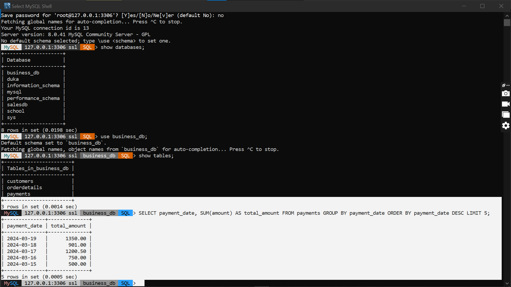
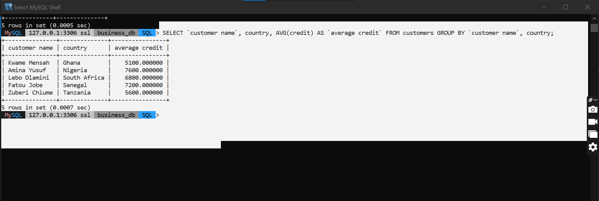
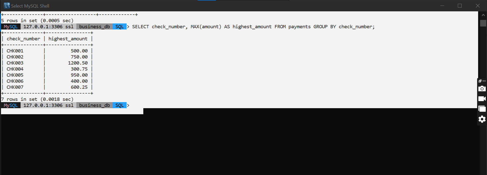

# 📝 Assignment: Advanced SQL Queries and Aggregations

## 🎯 Learning Objectives  
- Understand how to use aggregation functions such as SUM(), AVG(), and MAX() in SQL queries.  
- Learn to apply GROUP BY and ORDER BY clauses to structure and sort query results.  
- Gain experience in applying conditional logic to aggregate and filter data efficiently.  
- Practice using LIMIT to restrict the number of rows returned by a query.

---

## 📋 What You'll Need  
💻 A computer with internet access and a database setup (e.g., MySQL, PostgreSQL, etc.).  
📝 A text editor (e.g., Visual Studio Code, Sublime Text, or any SQL editor).  
📚 Intermediate knowledge of SQL queries, including aggregate functions and grouping.

---

## 📝 Submission Instructions  
📂 Write all your SQL queries in the **answers.sql** file.  
✍️ Answer each question concisely and make sure your queries are clear and correct.  
🗣️ Structure your responses clearly, and use comments if necessary to explain your approach.

---

## 📚 Assignment Questions    

### **Question 1**  
Write an SQL query to show the total payment amount for each payment date from **payments** table.  
- Display the **payment date** and the **total amount** paid on that date.  
- Sort the results by **payment date in descending order**.  
- Show only the **top 5 latest payment dates**.  

---

### **Question 2**  
Write an SQL query to find the average credit limit of each customer from **customers** table.  
- Display the **customer name**, **country**, and the **average credit limit**.  
- Group the results by **customer name and country**.  

---

### **Question 3**  
Write an SQL query to find the total price of products ordered from **orderdetails** table.  
- Display the **product code**, **quantity ordered**, and the **total price** for each product.  
- Group the results by **product code and quantity ordered**.  

---

### **Question 4** 

Write an SQL query to find the highest payment amount for each check number from **payments** table.  
- Display the **check number** and the **highest amount** paid for that check number.  
- Group the results by **check number**.  

---

Good luck 🚀
